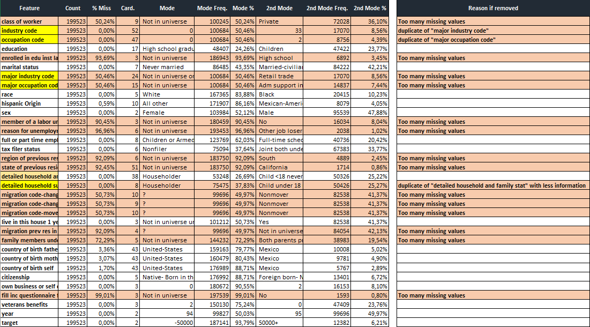
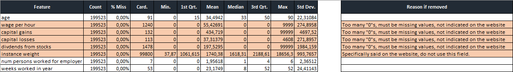
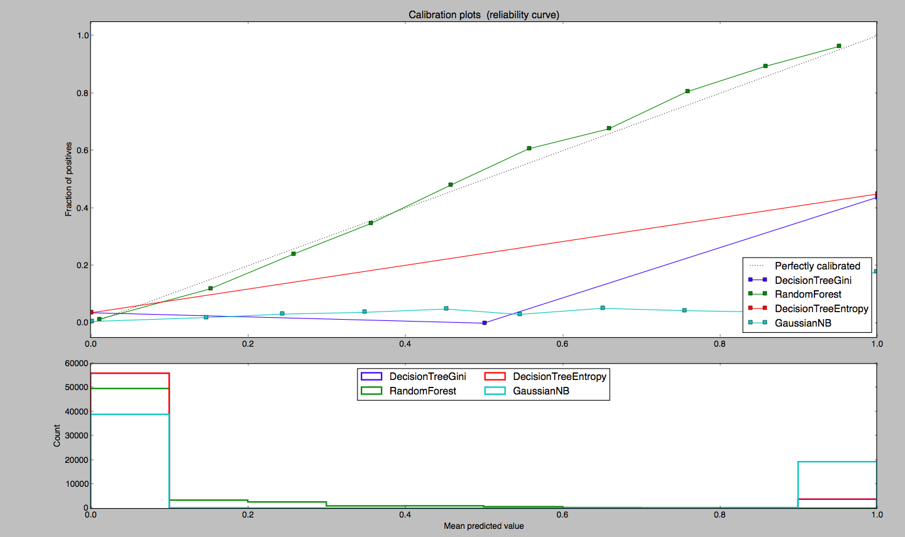
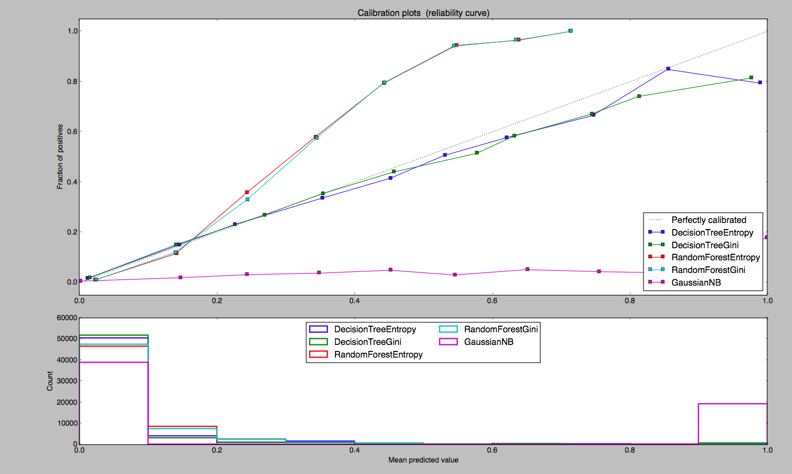

footer: Julien Couillard, Gwendal Rio, Jean Thévenet
slidenumbers: true
 
# Machine Learning
## Determining income
 
---
 
- Table of Contents
   1. Dataset Description
   1. Data Quality Report and Analysis
   1. Data Handling
    1. Modelling
    1. Jazz
    1. Reflections
 
 
---
 
# Dataset Description
 
- Gathered during a survey between the years *1994-1995*.
- Goal: find a correlation between *income and people's status.*
- Contains *199523 survey* responses from U.S. population.
- *41* demographic and employment related questions.
 
---
 
# Data Quality Report and Analysis
 
- *40* features
- A lot of *missing informations.*
- Some *duplicated features* (numerical indexes vs. words).
- Priority : *select the best features.*
 
---

---

---
 
# Data Handling
 
- *18 features ignored* based on misses and duplicate rates.
- Used a default of *50%, 20%, 30%* split after shuffling the rows.
- Missing values:
    - Categorical features : set to none.
    - Continuous features : No missing values because the features were removed.
 
---
 
# Modelling
 
- Depth tuning
- Estimator count (Random Forest)
- F1 score used
- Categorical features : set to none.
 
---

---

---
 
# Jazz
 
- Everything designed using an easy to use launcher & object-based code.
- Test also a model which always reports "true" (binary target).
- Display of each of the trees types accuracies using graphs.
- Added many tree types.
- Used a validation set and applied tree pre-pruning.
 
---
 
# Reflections
 
- Misunderstanding between members of the group.
- Only one of us already used the python language.
 
---
 
# Conclusion
 
---
 
# Thanks
 
| Tree type             | Accuracy | F1 Score |
| --------------------- | -------  | -------- |
| Entropy Decision Tree | 93.04%   | 96.28%   |
| Gini Decision Tree    | 93.04%   | 96.29%   |
| Entropy Random Forest | 95.07%   | 97.42%   |
| Gini Random Forest    | 95.07%   | 97.42%   |
| Naive Gaussian Tree   | 71.72%   | 83.34%   |
 
 
 
---
 
